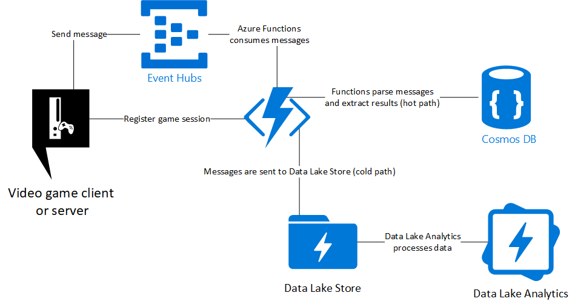

[](LICENSE)
[](http://makeapullrequest.com)
[](https://github.com/dgkanatsios/gaforgithub)


# GameAnalyticsEventHubFunctionsCosmosDatalake

A simple architecture to consume and process messages coming from video game clients (or servers) using the following Azure services:

- Event Hubs
- Functions
- Cosmos DB
- Data Lake Store
- Data Lake Analytics

Click here to deploy to Azure
<a href="https://portal.azure.com/#create/Microsoft.Template/uri/https%3A%2F%2Fraw.githubusercontent.com%2Fdgkanatsios%2FGameAnalyticsEventHubFunctionsCosmosDatalake%2Fmaster%2Fazuredeploy.json" target="_blank"></a>

Once the deployment finishes, you need to connect the independent resources (TO BE DOCUMENTED).

## Scenario

The scenario is based on a hypothetical multiplayer online game. Gamers connect to multiple game servers and compete among themselves. Gamers can have a 'win' or a 'loss'. You can think of wins/losses

## Architecture



## Terminology

- *Game session*: a single round of a multiplayer game
- *Wins*: a 'win' of a user versus another one. This could be a 'kill' in a First Person Shooter, a bypassing in a racing game, a goal in a soccer match
- *Losses*: the exact opposite of the win, depending on the game scenario
- *winnerID*: the user that accomplished the win
- *loserID*: the user that suffered the loss from *winnerID*

## Data flow

- Game server registers the game by calling the *registergamesession* Function. Each game has a sessionID which is formattted like *year-month-day_GUID*. Game server also submits the list of players that will participate in this game session. For this demo, we suppose that users cannot enter the game after it has began.
```javascript
const gameDocument = {
                gameSessionID: string, //the game SessionID, its format is "DATE_GUID"
                type: string, //random game type, for the demo its format is "type" + random integer
                map: string, //random map, for the demo its format is "map" + random integer
                players: array, //array of player objects
                startDate: string //JS Date object
            };    
const player = {
        playerID: string, //playerID
        playerCountry: string //country the player connects from
    };     
```
- Game server sends messages to Event Hub using the format:
```javascript
const event = {
                    eventID: string, //a unique event ID, its format is "GUID_gameSessionID"
                    gameSessionID: string, 
                    winnerID: string, //playerID of the winner
                    loserID: string, //player ID of the loses
                    special: string, //special attribute(s) for this win, like 'Low health'
                    eventDate: string //JS Date Object
                };          
```
- Event Hub triggers the dataingest Function which receives the messages in batch. Messages are sent to Azure Data Lake Store without any processing (cold path) whereas they are aggregated and sent to Cosmos DB (hot path)
- Game server or client can call *statistics* Function passing the gameSessionID as argument and get game session related data
- External service can use Data Lake Analytics jobs to query data in Data Lake Store (there is a relevant .usql script on the *various* folder). The output of these jobs can be ingested into other services (via Data Factory) or be used directly from a visualization platform such as PowerBI.

### Functions' details

#### registergamesession

This Function is used to register a game session and store relevant metadata. Data is stored into Cosmos DB as well as two CSV files in Data Lake Store. On the first file, we store details about each unique game session. The filename is '/YEAR/MONTH/DAY/gamesessions.csv' whereas the data that's being appended to it has the format:

```javascript
const line = `${gameDocument.gameSessionID},${gameDocument.type},${gameDocument.map},${gameDocument.startDate}\n`;
```

The second file is '/YEAR/MONTH/DAY/playerspergamesession.csv'. On this file, we store data about each player that will participate in the current game session. Data has the format:

```javascript
const line = `${gameDocument.gameSessionID},${player.playerID},${player.playerCountry}\n`;
```

#### dataingest

This Function is triggered by Event Hub. It fetches messages in batch, stores an aggregation on Cosmos DB as well as appends message data to Data Lake Store. Filename is '/YEAR/MONTH/DAY/gameevents.csv' and data is appended in CSV format, with each line containing having the following format:

```javascript
const line = `${message.eventID},${message.gameSessionID},${message.winnerID},${message.loserID},${message.special},${message.eventDate}\n`;
```

#### statistics

This Function is an HTTP triggered one. It accepts the gameSessionID as an argument and returns details (players, wins, losses, etc.) about the specific gameSession by connecting to Cosmos DB and fetching/aggregating the relevant documents.

## FAQ

#### Is this the best architecture / solution?
Of course not. It always depends on your requirements. For example, you could swap Event Hubs with Kafka, Functions with Stream Analytics, Data Lake Analytics with Databricks or HDInsight. This is *one* implementation of a data streaming and processing pipeline, it can certainly work well and scale, however you are encouraged to modify parts of this solution towards your objectives. For an overview of Data architectures on Azure, check [here](https://docs.microsoft.com/en-us/azure/architecture/data-guide/).

#### Are messages meant to be sent from the game client or server?
It depends. Clients can hack (especially on PC) the messages and send malicious data to your Event Hubs. You wouldn't want to have users cheat on their ranking, right? The best approach would be to have the game server send the important messages (e.g. user1 killed user2) whereas game clients can send less important messages, like behavioral ones (e.g. in an adventure game, user's response to the question was the second one or it took 2' for the user to solve this puzzle or reach the goal).

#### How can I modify the communication between Event Hubs and Azure Functions?
You should check the parameters listed [here](https://docs.microsoft.com/en-us/azure/azure-functions/functions-host-json#eventhub). Moreover, you are encouraged to read [here](https://docs.microsoft.com/en-us/azure/azure-functions/functions-bindings-event-hubs#trigger---scaling) regading Functions' scaling when using the Event Hubs trigger. Finally, check [here](https://docs.microsoft.com/en-us/azure/azure-functions/functions-best-practices) for performance best practices for Azure Functions.

#### Are you doing anything specific to optimize parallel data ingestion into Data Lake Store?
Yes, we are using the ConcurrentAppend method of the Data Lake Store API, check [here](https://docs.microsoft.com/en-us/dotnet/api/microsoft.azure.management.datalake.store.filesystemoperationsextensions.concurrentappendasync?view=azure-dotnet) for details. For more information on how to fine-tune Azure Data Lake for performance, check [here](https://docs.microsoft.com/en-us/azure/data-lake-store/data-lake-store-performance-tuning-guidance).

#### I want to read more information regarding Event Hubs.
Check out the excellent documentation [here](https://docs.microsoft.com/en-us/azure/event-hubs/event-hubs-features). For techniques on how to optimize event ingestion and consumption, check [here](https://blogs.msdn.microsoft.com/appserviceteam/2017/09/19/processing-100000-events-per-second-on-azure-functions/). For in order event processing with Event Hubs and Azure Functions check [here](https://medium.com/@jeffhollan/in-order-event-processing-with-azure-functions-bb661eb55428) whereas you can check [here](https://hackernoon.com/reliable-event-processing-in-azure-functions-37054dc2d0fc) for reliable event processing. For a comprehensive article that compares Event Hubs to other Azure messaging services, check [here](https://azure.microsoft.com/en-us/blog/events-data-points-and-messages-choosing-the-right-azure-messaging-service-for-your-data/).