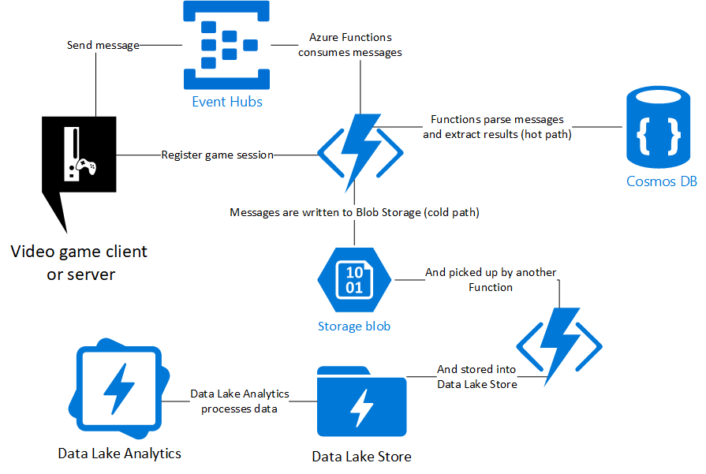

# GameAnalyticsEventHubFunctionsCosmosDatalake

A simple architecture to consume and process messages coming from video game clients (or servers) using the following Azure services:

- Event Hubs
- Functions
- Cosmos DB
- Data Lake Store
- Data Lake Analytics

Click here to deploy to Azure

## Architecture

## FAQ

#### Is this the best architecture?
Of course not. It always depends on your requirements. For example, you could swap Event Hubs with Kafka, Functions with Stream Analytics, Data Lake Analytics with Databricks or HDInsight. This is *one* implementation of a data streaming and processing pipeline, it can certainly work well and scale, however you are encouraged to modify parts of this solution towards your objectives.

#### Are messages meant to be sent from the game client or server?
It depends. Clients can hack (especially on PC) the messages and send malicious data to your Event Hubs. You wouldn't want to have users cheat on their ranking, right? The best approach would be to have the game server send the important messages (e.g. user1 killed user2) whereas game clients can send less important messages, like behavioral ones (e.g. in an adventure game, user's response to the question was the second one or it took 2' for the user to solve this puzzle or reach the goal).